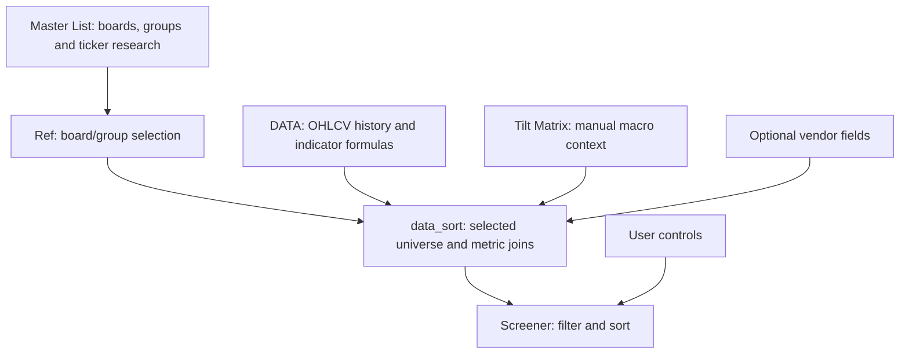

# Thematic Scanner

**An Excel-based thematic equity and ETF screener for organizing research watchlists and comparing technical conditions across securities.**

> **Project status: documentation preview.** I am preparing a separate public demonstration workbook. The original model has been described in a technical handoff, but I have **not yet independently verified the updated 150-block implementation**. The downloadable Excel demo, screenshots and operating guide will be added only after testing. There are intentionally no broken download or image links here.

## Why I built it

I follow companies and ETFs through investment themes. I wanted to move between a curated group of securities and a consistent set of market statistics without rebuilding a watchlist or manually repeating the same technical calculations for every name. I built this scanner to combine my thematic research with a filterable, sortable comparison table.

It is a **research and watchlist tool**, not an automated trade generator. The results help me decide what deserves a closer look; they do not establish a security's expected return or prescribe a position.

## What the model does

According to the original-workbook technical handoff, the screener organizes **40 thematic boards**, containing **1,517 board entries and 873 unique tickers**. It displays a **20-column** results table. Those are reported characteristics of the earlier version, **not independently audited current counts**.

- **Organize the universe:** choose a thematic board and optional group; securities can belong to more than one board.
- **Calculate technical context:** trailing returns, moving averages, ATR-normalized price extension, volume statistics, RSI and MFI from daily price/volume history.
- **Filter candidates:** set a minimum trend score and upper/lower ATR-multiple boundaries.
- **Sort the output:** arrange eligible candidates by one selected metric, ascending or descending.
- **Include judgmental context:** show a hand-assigned macro-quadrant tilt, clearly separate from computed indicators.

The original private workbook also displayed a few Options Samurai-supplied fields. These are vendor statistics rather than calculations developed by this screener; they will not be redistributed as licensed data in the public demo.

## How I use the scanner

1. Open the Screener and choose a **BOARD** and optional **GROUP**.
2. Check the market-data as-of dates, available/processed counts and exclusions. This reporting is a **planned improvement** and has not yet been verified in the updated workbook.
3. Start with broad thresholds, then adjust **MIN TREND SCORE** and **MIN/MAX ATR MULT.** to narrow the candidate list.
4. Choose **SORT BY** and direction to compare the resulting securities.
5. Review trend, extension, volume and momentum alongside my existing thematic research; make trading and risk decisions separately.

## A look at the calculations

The handoff identifies the following ATR-normalized extension measure:

```text
ATR Multiple = (Close / SMA50 - 1) / (ATR14 / Close)
```

A positive value means price is above its 50-observation simple moving average; the ratio expresses that percentage extension relative to ATR as a percentage of price. It does **not** by itself indicate that a stock is likely to rise or fall.

The trend score uses two price-above-average flags:

```text
Trend Score = 0.5 × [1(Close > SMA21) + 1(Close > SMA112)]
```

It produces **0, 0.5 or 1**, not a probability. Screening then uses explicit pass/fail thresholds, followed by sorting on a single chosen column; there is no verified weighted multi-factor stock-ranking engine in this model.

[Read the indicator and screening methodology](docs/methodology.md).

## Architecture



The previously inspected workbook was reported to have **100 price-history processing blocks**. The expansion to **150 blocks is planned/in progress, not yet validated**. Adding 50 blocks must also extend ticker assignment, indicator formulas, summary rows, lookups and displayed results; overflow must be visible rather than silently dropping names.

[See the detailed system architecture](docs/architecture.md).

## Download — coming after validation

**The public demonstration workbook is not available yet.** It will use synthetic, reproducible market data and a separate sanitized copy of the spreadsheet. Before publication I will verify the updated 150-ticker processing capacity, data-date alignment, missing-data handling, screen filters and the absence of private or licensed information.

The original calculation design depends on modern **Microsoft 365 Excel** dynamic-array functions (`LET`, `MAP`, `LAMBDA`, `FILTER`, `SORTBY`, and related behavior). Compatibility with other spreadsheet applications is not assumed.

## Current limitations

The technical handoff reported a 100-name processing ceiling in the earlier model, potentially mixed last-observation dates, silently masked data errors, inconsistent board counts, and some indicator labels that did not match their expanding-window calculations. Whether the new workbook fixes these remains to be checked.

This screener has **no documented backtest, forward test or demonstrated predictive performance**. The universe is curated, and macro labels are discretionary. These features make the tool useful for organizing research but cannot establish investment performance.

[Read known limitations and validation gaps](docs/limitations.md).

## Project documentation

- [Architecture and data flow](docs/architecture.md)
- [Quantitative and screening methodology](docs/methodology.md)
- [Limitations and outstanding verification](docs/limitations.md)
- [Public demo build and acceptance tests](docs/demo-build-plan.md)
- [Screenshot capture plan](docs/screenshot-guide.md)
- [Publication checklist](PUBLICATION_CHECKLIST.md)

## Next milestone

Receive Claude's revised 150-block Excel workbook, audit it independently, then build and test a **synthetic public demonstration**. After that I will add a downloadable workbook, populated screenshots, and a practical operating guide explaining the workflow and formulas.

---

*Self-directed analytical project. The repository currently documents a work in progress; it does not present live results, investment advice, or a validated trading strategy.*