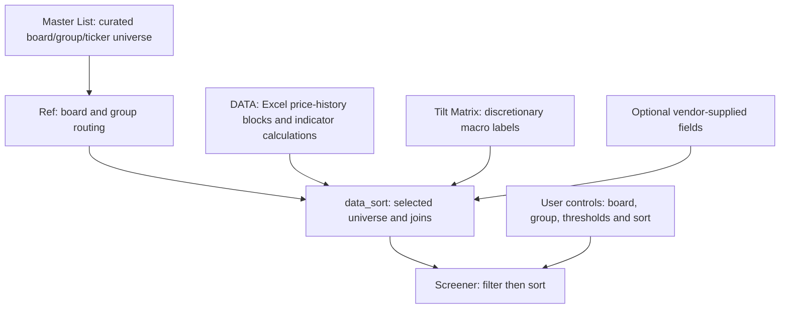

# System architecture

> **Documentation status:** Based on Claude's technical handoff for an earlier `SCANNER.xlsx`. I have not independently verified this against the updated workbook. The move from 100 to 150 blocks is planned/in progress, **not yet validated**.

## Data flow

## Worksheets described in the handoff

| Sheet | Reported role |
|---|---|
| `Master List` | Curated ticker universe, themes, groups and research notes. A ticker may belong to multiple boards. |
| `Ref` | Board/group registry and selection ranking. Reported as hidden in the original. |
| `DATA` | Separate historical OHLCV processing blocks, indicator formulas and summary records. |
| `data_sort` | Combines board-specific descriptive fields with ticker-specific technical statistics. |
| `Tilt Matrix` | Manually assigned group-by-macro-quadrant context. Not a predictive macro model. |
| `Screener` | Interactive controls and a dynamic-array output. The main reported output formula begins at `Screener!D12`. |
| `Board Map` | Board/group reference and counts; several counts require checking. |

The handoff also mentions `FOCUS`, `Sheet2` and a `Claude Log`; their status and any undocumented automation need confirmation against the new file.

## Reported processing sequence

1. Choose board and optional group in the Screener.
2. `Ref` identifies matching Master List entries and assigns ranks.
3. `data_sort` rebuilds the selected list, retaining board-specific notes.
4. The ticker list drives separate `STOCKHISTORY` blocks in `DATA` in the original model.
5. `DATA` computes indicators and emits ticker-level summaries.
6. `data_sort` joins metrics back to the selected list, reported to use `XLOOKUP` for ticker metrics.
7. The screener filters eligible observations and applies a user-selected sort.
8. The macro quadrant changes a *manual label* from `Tilt Matrix`, not the underlying technical indicators.

## Capacity and formula dependencies

The original implementation was reported to allocate **100 price-history blocks**, each with a **14-column stride**. The summary reportedly uses block arithmetic resembling `OFFSET(...,14*(BlockID-1),...)`, and its lookup range was fixed at `DATA!BBR8:BBR107` (100 records). These locations describe the *original* workbook only.

The proposed 150-block update must be confirmed at every layer, not merely by adding 50 blank blocks: ticker assignment, all 150 sets of history/indicator formulas, summary rows, lookup ranges, dropdown/count logic, and final results must extend correctly. Validate blocks **1, 100, 101 and 150** and the overflow case of **151** entries.

## Data integrity requirements

- Use an explicit cross-sectional **as-of date** and distinguish fresh, stale, missing and insufficient-history observations. The original per-ticker blocks could finish on different trading dates.
- Make matched, processed, filtered and excluded ticker counts reconcile; report capacity exclusions explicitly.
- Do not use silent `IFERROR(...,"")` outputs as the only error handling mechanism.
- Keep workbook columns and exact-text board/group keys stable unless all downstream references are migrated.
- Preserve the 20-column output schema if modifying the original Screener formula.

A synthetic dataset with aligned dates can demonstrate the intended design, but **does not itself repair live-data alignment**. The updated workbook needs an independent audit before any of these items can be described as implemented.